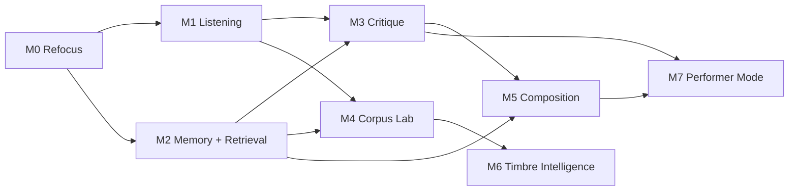

# LivePilot V2 Backlog

## Epics, Milestones, Dependencies, and Acceptance Criteria

**Author:** Codex  
**Date:** 2026-03-27  
**Companion docs:**  
- [2026-03-27-v2-deep-research-roadmap.md](./2026-03-27-v2-deep-research-roadmap.md)  
- [2026-03-27-v2-technical-spec-and-priority-plan.md](./2026-03-27-v2-technical-spec-and-priority-plan.md)

---

## 1. Purpose

This file translates the V2 vision into an execution-ready backlog.

It is designed to answer:

- what should be built first
- what each epic is trying to achieve
- what specific tickets belong inside each epic
- what depends on what
- how we know a ticket is done

This backlog is intentionally opinionated.

It assumes:

- depth matters more than feature count
- V2 succeeds by improving hearing, retrieval, critique, and co-agency
- low-level tool expansion is not the main priority

---

## 2. Planning Rules

### Priority levels

- `P0` = critical foundation, blocks multiple later epics
- `P1` = important, directly user-visible, should follow once foundations are stable
- `P2` = valuable but deferrable
- `P3` = optional / experimental / future-facing

### Status model

- `todo`
- `in_progress`
- `blocked`
- `done`

### Ticket shape

Each ticket should have:

- an ID
- a short title
- a priority
- dependencies
- acceptance criteria

### Execution rule

If a ticket does not improve at least one of the following, question whether it belongs in V2:

- hearing
- retrieval
- critique
- variation
- co-agency

---

## 3. Milestones

This is the recommended milestone order.

### M0: V2 Refocus

Goal:

- narrow scope
- create architecture boundaries
- stop accidental bloat

### M1: Listening Foundation

Goal:

- ship stronger offline analysis and analysis snapshots

### M2: Semantic Memory + Retrieval Foundation

Goal:

- make prior work and audio assets searchable by sound and context

### M3: Critique Engine

Goal:

- ship reference comparison and arrangement/mix diagnostics

### M4: Corpus Lab

Goal:

- turn LivePilot into a real sound research environment

### M5: Mixed-Initiative Composition

Goal:

- move from command execution to useful co-creative variation and continuation

### M6: Timbre Intelligence

Goal:

- unlock text-guided timbre search and optional neural timbre modules

### M7: Performer Mode

Goal:

- support legible, safe, constrained live co-agency

---

## 4. Milestone Dependency Graph

---

## 5. Epic List

### EPIC-00: V2 Refocus And Architecture Boundaries

Milestone:

- M0

Purpose:

- stop scope drift
- create internal clarity
- define what V2 is really trying to become

#### LPV2-001: Freeze low-value tool expansion

Priority:

- P0

Dependencies:

- none

Acceptance criteria:

- a written rule exists for when new MCP tools may be added
- low-level tool additions require workflow justification
- current backlog does not include “tool count increase” as a success metric

#### LPV2-002: Produce workflow-based inventory of current tools

Priority:

- P0

Dependencies:

- LPV2-001

Acceptance criteria:

- every current tool is categorized by workflow
- redundant or low-ROI tools are marked
- the team can identify which tools are core, auxiliary, or likely deprecated

#### LPV2-003: Establish V2 module boundaries

Priority:

- P0

Dependencies:

- none

Acceptance criteria:

- ownership boundaries are defined for control, analysis, memory, retrieval, critique, compose, and performance modules
- no new major logic lands in ad hoc locations once boundaries are set

#### LPV2-004: Define V2 data contracts

Priority:

- P0

Dependencies:

- LPV2-003

Acceptance criteria:

- draft schemas exist for SessionAnalysisSnapshot, AudioAssetRecord, TechniqueRecordV2, CritiqueReport, and WorkflowOutcome
- schemas are reviewed for extensibility and local-first storage

#### LPV2-005: Add minimal product telemetry for workflow usage

Priority:

- P1

Dependencies:

- LPV2-003

Acceptance criteria:

- workflow usage can be logged locally
- at minimum, analysis, retrieval, critique, and composition workflow calls are countable
- logs are opt-out or clearly documented

---

### EPIC-01: Listening Foundation

Milestone:

- M1

Purpose:

- give the system stronger ears

#### LPV2-010: Create offline audio analysis job framework

Priority:

- P0

Dependencies:

- LPV2-003
- LPV2-004

Acceptance criteria:

- analysis jobs can run on local audio files asynchronously
- jobs write stable outputs to cache
- failed jobs produce structured errors

#### LPV2-011: Implement baseline descriptor extraction

Priority:

- P0

Dependencies:

- LPV2-010

Acceptance criteria:

- analysis returns loudness, spectral, temporal, and tonal descriptor sets
- outputs are normalized and versioned
- descriptor extraction works on mono and stereo sources

#### LPV2-012: Implement rhythm and groove analysis

Priority:

- P0

Dependencies:

- LPV2-010

Acceptance criteria:

- analysis returns beat positions, tempo confidence, onset density, and groove-relevant metrics
- results are stable across a canonical test set
- obvious edge cases are documented

#### LPV2-013: Implement segmentation and novelty analysis

Priority:

- P1

Dependencies:

- LPV2-010

Acceptance criteria:

- section or phrase boundary candidates can be computed for clips and longer renders
- novelty curve is stored in analysis snapshots
- outputs are usable by critique workflows

#### LPV2-014: Create SessionAnalysisSnapshot persistence layer

Priority:

- P0

Dependencies:

- LPV2-004
- LPV2-011
- LPV2-012

Acceptance criteria:

- analysis snapshots can be saved, retrieved, and versioned
- snapshots contain descriptor blocks and scope metadata
- snapshots can be reused without recomputation

#### LPV2-015: Expose first high-level analysis workflows

Priority:

- P1

Dependencies:

- LPV2-014

Acceptance criteria:

- at least `analyze_section`, `analyze_groove`, and `analyze_reference_delta` workflows exist
- outputs are concise, structured, and useful to an agent or user

---

### EPIC-02: Semantic Memory + Retrieval Foundation

Milestone:

- M2

Purpose:

- make LivePilot remember and retrieve by sound, context, and outcome

#### LPV2-020: Introduce TechniqueRecordV2 schema

Priority:

- P0

Dependencies:

- LPV2-004

Acceptance criteria:

- technique records can store perceptual profiles and usage history
- old technique data can coexist or be migrated safely

#### LPV2-021: Add audio asset catalog

Priority:

- P0

Dependencies:

- LPV2-004

Acceptance criteria:

- audio assets can be indexed as samples, renders, stems, references, or field recordings
- asset records store core metadata and analysis refs

#### LPV2-022: Integrate local vector index

Priority:

- P0

Dependencies:

- LPV2-020
- LPV2-021

Acceptance criteria:

- embeddings can be inserted and queried locally
- nearest-neighbor search returns results within acceptable latency on a modest corpus

#### LPV2-023: Implement embedding pipeline for audio assets

Priority:

- P0

Dependencies:

- LPV2-021
- LPV2-022

Acceptance criteria:

- indexed audio assets can receive embeddings
- embeddings are cached and versioned
- re-indexing can be triggered intentionally

#### LPV2-024: Implement hybrid search ranking

Priority:

- P1

Dependencies:

- LPV2-022
- LPV2-023
- LPV2-014

Acceptance criteria:

- retrieval can combine text, tags, descriptors, embeddings, and usage signals
- ranking behavior is testable and configurable

#### LPV2-025: Implement WorkflowOutcome logging

Priority:

- P1

Dependencies:

- LPV2-020

Acceptance criteria:

- workflow outcomes can store accepted/rejected/revised signals
- outcomes can be linked to techniques and analysis snapshots

#### LPV2-026: Expose first retrieval workflows

Priority:

- P1

Dependencies:

- LPV2-024

Acceptance criteria:

- at least `find_similar_audio`, `find_related_chains`, and `search_corpus_by_text` workflows exist
- results include confidence and summary evidence where relevant

---

### EPIC-03: Critique Engine

Milestone:

- M3

Purpose:

- make LivePilot diagnostically useful

#### LPV2-030: Define CritiqueReport schema

Priority:

- P0

Dependencies:

- LPV2-004

Acceptance criteria:

- critique reports support summary, confidence, findings, and recommended moves
- schema is shared across critique workflows

#### LPV2-031: Build reference comparison engine

Priority:

- P0

Dependencies:

- LPV2-014
- LPV2-021

Acceptance criteria:

- current material can be compared with a reference at section level
- outputs identify key deltas, not just raw metrics

#### LPV2-032: Build stagnation detector

Priority:

- P1

Dependencies:

- LPV2-014
- LPV2-013

Acceptance criteria:

- the system can detect low contrast, insufficient development, or static repetition patterns
- at least one canonical example validates the usefulness of the result

#### LPV2-033: Build masking and density diagnostics

Priority:

- P1

Dependencies:

- LPV2-014

Acceptance criteria:

- reports can flag likely low-mid congestion, transient masking, or spectral crowding scenarios
- results are phrased as likelihoods, not fake certainties

#### LPV2-034: Build arrangement arc diagnostics

Priority:

- P1

Dependencies:

- LPV2-013
- LPV2-031

Acceptance criteria:

- the system can describe whether sections are differentiating enough over time
- outputs are understandable to producers, not only MIR researchers

#### LPV2-035: Expose first critique workflows

Priority:

- P1

Dependencies:

- LPV2-030
- LPV2-031
- LPV2-032

Acceptance criteria:

- at least `critique_mix_section`, `diagnose_stagnation`, and `critique_arrangement_arc` workflows exist
- at least one human evaluation pass has been run on their usefulness

---

### EPIC-04: Corpus Lab

Milestone:

- M4

Purpose:

- make LivePilot useful as a sound research and archive exploration system

#### LPV2-040: Build corpus ingestion pipeline

Priority:

- P0

Dependencies:

- LPV2-021
- LPV2-010

Acceptance criteria:

- a directory of audio material can be scanned and indexed
- duplicate or unchanged files are not fully reprocessed unnecessarily

#### LPV2-041: Add segmentation and slice extraction for corpus assets

Priority:

- P1

Dependencies:

- LPV2-040
- LPV2-013

Acceptance criteria:

- longer files can be segmented into search-ready slices or regions
- slices can inherit parent metadata

#### LPV2-042: Implement nearest-neighbor corpus search

Priority:

- P0

Dependencies:

- LPV2-023
- LPV2-040

Acceptance criteria:

- by-example retrieval works over indexed corpus assets
- results can be filtered by tags or type

#### LPV2-043: Implement descriptor-targeted search

Priority:

- P1

Dependencies:

- LPV2-011
- LPV2-040

Acceptance criteria:

- users can steer results using descriptor-like targets such as brighter, rougher, shorter, more percussive

#### LPV2-044: Add preview and load-back workflow

Priority:

- P1

Dependencies:

- LPV2-042

Acceptance criteria:

- corpus results can be auditioned and loaded back into Live cleanly
- the workflow avoids confusing dead ends

#### LPV2-045: Build first corpus report workflow

Priority:

- P2

Dependencies:

- LPV2-042
- LPV2-043

Acceptance criteria:

- the system can summarize a corpus region or search result family in musically useful language

---

### EPIC-05: Mixed-Initiative Composition

Milestone:

- M5

Purpose:

- shift from execution to co-creation

#### LPV2-050: Define composition constraint schema

Priority:

- P0

Dependencies:

- LPV2-004

Acceptance criteria:

- constraints can express identity preservation, role restrictions, density ceilings, tonal limits, and range limits

#### LPV2-051: Build phrase continuation engine

Priority:

- P1

Dependencies:

- LPV2-050
- LPV2-014

Acceptance criteria:

- system can continue a phrase or loop under explicit constraints
- outputs are returned as ranked options

#### LPV2-052: Build variation family generator

Priority:

- P1

Dependencies:

- LPV2-050

Acceptance criteria:

- one source pattern can yield a family of related options with clear change dimensions
- at least one workflow preserves identity while changing only one or two aspects

#### LPV2-053: Build role-aware planner

Priority:

- P1

Dependencies:

- LPV2-050

Acceptance criteria:

- composition proposals can operate in terms of kick, bass, harmonic bed, lead, percussive texture, transition layer, and similar musical roles

#### LPV2-054: Build section development planner

Priority:

- P2

Dependencies:

- LPV2-051
- LPV2-052
- LPV2-034

Acceptance criteria:

- the system can propose how a section should evolve over multiple bars instead of only producing local variations

#### LPV2-055: Expose first composition workflows

Priority:

- P1

Dependencies:

- LPV2-051
- LPV2-052

Acceptance criteria:

- at least `continue_phrase`, `propose_variation_family`, and `plan_section_development` workflows exist
- outputs include rationale and confidence

---

### EPIC-06: Timbre Intelligence

Milestone:

- M6

Purpose:

- make LivePilot stronger at timbre semantics and transformation

#### LPV2-060: Add text-audio embedding support

Priority:

- P1

Dependencies:

- LPV2-022

Acceptance criteria:

- text queries can be embedded and used in retrieval
- the model path and versioning are documented

#### LPV2-061: Build text-guided timbre search workflow

Priority:

- P1

Dependencies:

- LPV2-060
- LPV2-024

Acceptance criteria:

- prompts like “hollower,” “more brittle,” or “warmer but closer” can influence retrieval results
- the system exposes uncertainty and does not overclaim semantic precision

#### LPV2-062: Create optional model worker interface

Priority:

- P0

Dependencies:

- LPV2-003

Acceptance criteria:

- heavy model-backed tasks run outside the critical control path
- failures in a model worker cannot take down the core system

#### LPV2-063: Prototype neural timbre module integration

Priority:

- P2

Dependencies:

- LPV2-062

Acceptance criteria:

- at least one external timbre model pathway can be invoked in a controlled experimental manner
- it is clearly marked as optional/experimental

---

### EPIC-07: Performer Mode

Milestone:

- M7

Purpose:

- support live co-agency and interactive art safely

#### LPV2-070: Define performance behavior state model

Priority:

- P0

Dependencies:

- LPV2-004

Acceptance criteria:

- performer mode has explicit states such as listening, waiting, proposing, constrained_action, frozen
- behavior transitions are documented

#### LPV2-071: Build safety and interrupt system

Priority:

- P0

Dependencies:

- LPV2-070

Acceptance criteria:

- panic freeze, behavior reset, and action ceiling controls exist
- performer-facing emergency controls can stop autonomous behavior immediately

#### LPV2-072: Build cue engine

Priority:

- P1

Dependencies:

- LPV2-070

Acceptance criteria:

- live cues can trigger constrained transitions or prepared actions
- cue handling is deterministic and logged

#### LPV2-073: Build co-agency state summary

Priority:

- P1

Dependencies:

- LPV2-070

Acceptance criteria:

- the system can expose its current mode, current confidence, current constraints, and recent actions in a compact form

#### LPV2-074: Expose first performer workflows

Priority:

- P2

Dependencies:

- LPV2-071
- LPV2-072

Acceptance criteria:

- at least `set_behavior_mode`, `apply_cue_transition`, and `panic_freeze` workflows exist
- performer mode can be demoed without opaque surprises

---

## 6. Cross-Cutting Tickets

These do not belong to only one epic.

### LPV2-100: Establish canonical evaluation audio set

Priority:

- P0

Dependencies:

- none

Acceptance criteria:

- a local set of clips, loops, stems, references, and edge-case materials exists for testing and demos

### LPV2-101: Add golden tests for analysis outputs

Priority:

- P1

Dependencies:

- LPV2-100
- LPV2-011

Acceptance criteria:

- at least a subset of analysis outputs are validated against stable fixtures

### LPV2-102: Add human-eval protocol for critique usefulness

Priority:

- P1

Dependencies:

- LPV2-035

Acceptance criteria:

- a simple repeatable process exists to score critique usefulness and actionability

### LPV2-103: Add human-eval protocol for retrieval relevance

Priority:

- P1

Dependencies:

- LPV2-026

Acceptance criteria:

- retrieval quality can be reviewed on curated query sets

### LPV2-104: Add migration plan for V1 memory data

Priority:

- P1

Dependencies:

- LPV2-020

Acceptance criteria:

- old memory records can be safely migrated, wrapped, or coexisted with V2 schemas

---

## 7. Suggested Sprint Order

This is the most practical execution sequence.

### Sprint 1

- LPV2-001
- LPV2-002
- LPV2-003
- LPV2-004
- LPV2-100

### Sprint 2

- LPV2-010
- LPV2-011
- LPV2-014

### Sprint 3

- LPV2-012
- LPV2-013
- LPV2-015
- LPV2-101

### Sprint 4

- LPV2-020
- LPV2-021
- LPV2-022

### Sprint 5

- LPV2-023
- LPV2-024
- LPV2-026
- LPV2-104

### Sprint 6

- LPV2-030
- LPV2-031
- LPV2-032

### Sprint 7

- LPV2-033
- LPV2-034
- LPV2-035
- LPV2-102

### Sprint 8

- LPV2-040
- LPV2-042
- LPV2-044

### Sprint 9

- LPV2-041
- LPV2-043
- LPV2-045
- LPV2-103

### Sprint 10

- LPV2-050
- LPV2-051
- LPV2-052

### Sprint 11

- LPV2-053
- LPV2-055

### Sprint 12+

- LPV2-054
- LPV2-060
- LPV2-061
- LPV2-062
- LPV2-063
- LPV2-070
- LPV2-071
- LPV2-072
- LPV2-073
- LPV2-074

---

## 8. What To Say No To During V2

These are anti-backlog items.

### Do not prioritize

- expanding symbolic theory features just because they are intellectually attractive
- adding many micro-tools for completeness
- shipping broad “AI composer” claims before critique and retrieval are strong
- building heavy neural audio workflows before the optional worker interface exists
- building live autonomy before safety, freeze, and state visibility exist

### Only revisit later if supported by use

- giant cloud corpus features
- social sharing platforms
- automated end-to-end song generation
- vast preset-atlas expansion without automated support

---

## 9. Definition Of V2 Success

V2 is successful if, by the end of the roadmap, users can do all of the following:

- analyze a section and receive a musically believable diagnosis
- find related sounds or chains by sonic similarity or text intent
- compare their work to references in a useful way
- generate related variations that preserve identity
- search and explore a corpus of personal sounds as a research space
- trust the system more because it explains and critiques, not just acts

If V2 only increases the number of things LivePilot can technically do, but not the number of ways it can think, hear, and help, then V2 has failed.

---

## 10. Final Execution Instruction

If backlog pressure rises, cut breadth before you cut depth.

Protect these first:

- analysis
- memory
- retrieval
- critique

These are the foundations that make every later capability better.
